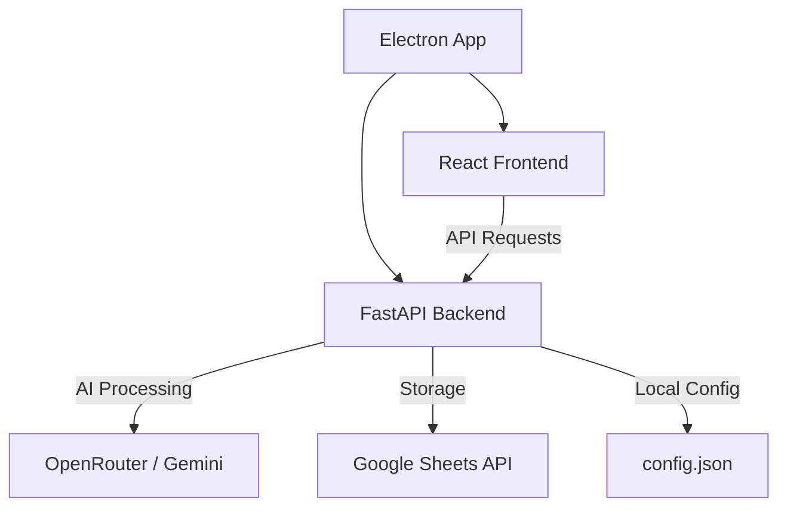

# 🌌 Antigravity Budget

[](https://opensource.org/licenses/MIT)
[](https://fastapi.tiangolo.com/)
[](https://reactjs.org/)
[](https://www.electronjs.org/)

**Antigravity Budget** is a premium, multi-modal expense tracker that leverages AI to automate your personal finance management. Stop manually entering every coffee and grocery trip—just speak it, text it, or snap a photo.

---

## ✨ Key Features

- 🎙️ **Voice & Text Capture**: Input transactions naturally. "Bought coffee for $5" or "Salary $3000". AI parses the rest.
- 📸 **Smart Receipt Scanning**: Upload images of receipts; the AI extracts items, prices, and dates with high accuracy.
- 🤖 **Gemini 2.5 Intelligence**: Powered by Google Gemini via OpenRouter for state-of-the-art transaction classification.
- 📊 **Dynamic Dashboard**: Real-time analytics, monthly summaries, and visual distribution of spending.
- 📅 **Google Sheets Backend**: Your data stays in *your* hands. All transactions are synced directly to a private Google Sheet.
- 🎯 **Budget Management**: Set monthly targets per category and track progress with visual alerts.
- 📁 **Vaults & Savings**: Track spending from specific savings funds or "Vaults" to see the impact on your net worth.
- 🎨 **Premium UI**: Sleek, glassmorphic design system with support for smooth animations and responsive layouts.

---

## 🚀 Desktop App Setup (Recommended)

The easiest way to use Antigravity Budget is by running the standalone Windows application.

### 1. Installation
- Download the `Antigravity Budget Setup.exe` from the latest release.
- Run the installer. The app will install and open automatically.

### 2. Initial Configuration
When you first launch the app, you'll be greeted with a **Setup Screen**. You will need three things:

#### A. OpenRouter API Key
1. Go to [OpenRouter.ai](https://openrouter.ai/keys).
2. Create a free account and generate an API key.
3. Paste the key into the app.

#### B. Google Sheet ID
1. Create a new Google Sheet.
2. Copy the ID from the URL: `docs.google.com/spreadsheets/d/`**`YOUR_SHEET_ID_HERE`**`/edit`.
3. Paste it into the app.

#### C. Google Service Account credentials
1. Go to [Google Cloud Console](https://console.cloud.google.com/).
2. Create a project and enable the **Google Sheets API** and **Google Drive API**.
3. Create a **Service Account** and generate a **JSON Key**.
4. **Share your Google Sheet** with the service account's email address (e.g., `app-tracker@your-project.iam.gserviceaccount.com`) as an "Editor".
5. Copy the entire contents of the JSON file you downloaded and paste it into the "Google Service Account JSON" field in the app.

---

## 🛠️ Developer Guide

### Prerequisites
- **Node.js** (v18+)
- **Python** (v3.11+)
- **OpenSSL** (for backend dependencies)

### Local Development Flow

1. **Clone the Repository**:
   ```bash
   git clone https://github.com/AbrarAhmad001/antigravity-budget.git
   cd antigravity-budget
   ```

2. **Backend Setup**:
   ```bash
   cd backend
   python -m venv venv
   source venv/bin/activate  # venv\Scripts\activate on Windows
   pip install -r requirements.txt
   ```
   Create a `.env` file in the `backend` directory (see [.env.example](backend/.env.example)).

3. **Frontend Setup**:
   ```bash
   cd ../frontend
   npm install
   npm run dev
   ```

4. **Running with Electron**:
   ```bash
   npm run electron:dev
   ```

### Building the Executable
To package the app for distribution:
1. Ensure the backend is built/packaged if necessary (see `backend/build_backend.py`).
2. Run `npm run electron:build` in the `frontend` directory.
3. The installer will be located in `frontend/release/`.

---

## 📂 Project Architecture



---

## 📝 License

Distributed under the MIT License. See `LICENSE` for more information.

## 🤝 Contact

**Abrar Ahmad** - [@AbrarAhmad001](https://github.com/AbrarAhmad001)

Project Link: [https://github.com/AbrarAhmad001/antigravity-budget](https://github.com/AbrarAhmad001/antigravity-budget)
